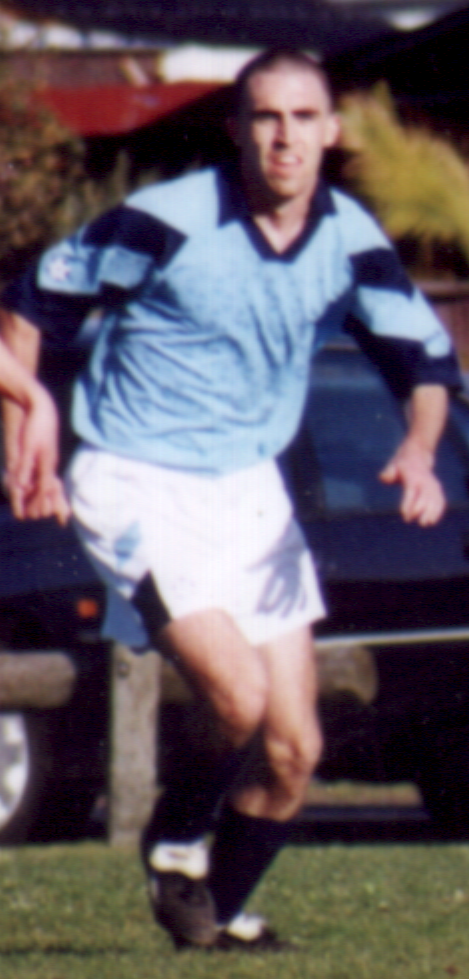

#### Born
 
Sydney, 1974

#### Years Involved

* 1998-2005
* 2008-2020

#### Club Roles

* Secretary (2018)
* Treasurer (2004, 2005)

#### Club Awards

* Club Person of the Year (2004, 2013, 2016, 2017) 

#### Team Roles

* Mens U-23 Coach (2016) 
* Mens Thirds Coach (2011, 2012) 

#### Team Playing Achievements

* Mens Seniors - Runners Up (2003)
* Mens Reserves - Champions (2016, 2017, 2018)
* Mens Reserves - Runners Up (2014)
* Mens Old Boys - Champions (2012)

#### Individual Playing Achievements

* Mens Seniors - B&F (2000) 
* Mens Old Boys - B&F (2013) 

#### Other Soccer

* Unigames - Silver Medal (2000)
* Unigames Womens Coach - Silver Medal (2014)

