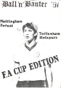

The "Ball and Banter" is the magazine of the Monash University Soccer Club - normally published annually to coincide
with presentation night.

| Edition                           | Editor                              | PDF                                                                                                                                            |
|-----------------------------------|-------------------------------------|------------------------------------------------------------------------------------------------------------------------------------------------|
| 2023 (Presentation Night)      | Ned Rocke                           | To be published                                                                                                                                |                                                              
| 2022 (Presentation Night)      | Chris Bounds and Andrew Patterson   |                            |                                                                                                                                                          
| 2021 (Presentation Night)      | N/A                                 | None produced due to COVID-19                                                                                                                  |
| 2020 (Presentation Night)      | N/A                                 | None produced due to COVID-19                                                                                                                  |
| 2019 (Presentation Night)      | Andrew Patterson                    |                            |
| 2018 (Presentation Night)      | Ned Rocke                           |                            |
| 2017 (Presentation Night)      | Ned Rocke                           | Patto has copy - to be turned in PDF                                                                                                           |
| 2016 (Presentation Night)      | Ned Rocke                           |                            |
| 2015 (Presentation Night)      | Ned Rocke                           |                            |
| 2015 (50th Anniversary Night)  | Andrew Patterson                    |  |
| 2014 (Presentation Night)      | Ena Augustin                        |                            |
| 2013 (Presentation Night)      | Ned Rocke                           |                            |
| 2012 (Presentation Night)      | Jill Pettigrew                      |                            |
| 2011 (Presentation Night)      | Jill Pettigrew                      |                            |
| 2010 (Presentation Night)      | Peter Sugija                        |                            |
| 2009 (Presentation Night)      | Chris Vinecombe and Miles Rodriquez |                            |
| 2008 (Presentation Night)      | Simon Serebryanikov                 |                            |
| 2007 (Presentation Night)      | Simon Serebryanikov                 |                            |
| 2006 (Presentation Night)      | Committee                           |                            |
| 2005 (Presentation Night)      | Andrew Patterson                    |                            |
| 2004 (Presentation Night)      | Andrew Patterson                    |                            |
| 2003 (Presentation Night)      | Andrew Patterson                    |                            |
| 2002 (Presentation Night)      | Tim Smurthwaite                     |                            |
| 2001 (Presentation Night)      | Tim Smurthwaite                     |                            |
| 2000 (Presentation Night)      | Tim Smurthwaite                     |                            |
| 1999 (Presentation Night)      | Tim Smurthwaite                     |                            |
| 1999 (Vale Jackie Roessler)    | Tim Smurthwaite                     |                                                                                                                                                |
| 1998                              | ?                                   | Missing                                                                                                                                        |
| 1997                              |                                     |                                                                                                                                                |
| 1996                              |                                     |                                                                                                                                                |
| 1995                              |                                     |                                                                                                                                                |
| 1994 (Presentation Night)      | Peter Frajsman                      |                            |                                             
| 1993                              |                                     |                                                                                                                                                |
| 1992 (Presentation Night)      | Peter Gaitanis                      |                            |                                             
| 1991 (Presentation Night)      | Alex de la Torre (?)                |                            |
| 1991 (FA Cup)                  |                                     |            |
| 1990 (Presentation Night)      |                                     |                            |                                             
| 1989 (Presentation Night)      | Peter Trbanc                        |                            |                                             
| 1988 (Presentation Night)      | Clinton Porteous                    |                            |                                             
| 1987 (Presentation Night)      | Phil Hawkins                        |                            |                                             
| 1986 (21st Anniversary)        | Phil Hawkins                        |                            |  
| 1985 (Presentation Night)      | Phil Hawkins (?)                    |                            |  
| 1984 (Presentation Night)      | Phil Hawkins                        |                            |  
| 1983 (Presentation Night)      | ??                                  |                            |  
| 1982                              |                                     |                                                                                                                                                |
| 1981                              |                                     |                                                                                                                                                | 
| 1980                              |                                     |                                                                                                                                                | 
| 1979                              |                                     |                                                                                                                                                | 
| 1978 (Presentation Night)      | Mike King and Vic Balos             |                            |                                                                                 
| 1977 (Combined Edition)        | ??                                  |                         |                                                                                  
| 1976                              | ??                                  |                                                                                                                       
| 1975                              | ??                                  |                                                                                                                       
| 1974                              | Bill Allen and Keith Morgan         | Missing (mentioned in 1986 Ball and Banter)                                                                                                    |
| 1967 (in Monash Sports Archive??) |                                     | MUSC Year Book                                                                                                                                 |                                                                                  
| 1966 (in Monash Sports Archive??) |                                     | MUSC Year Book                                                                                                                                 |                                                                                  
| 1965 (founded)                    | N/A                                 | None                                                                                                                                           |                                                                                       
